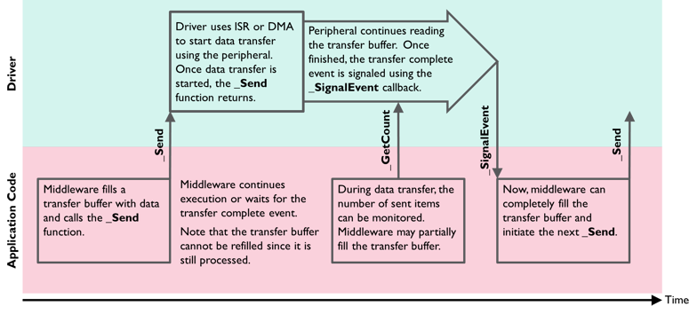
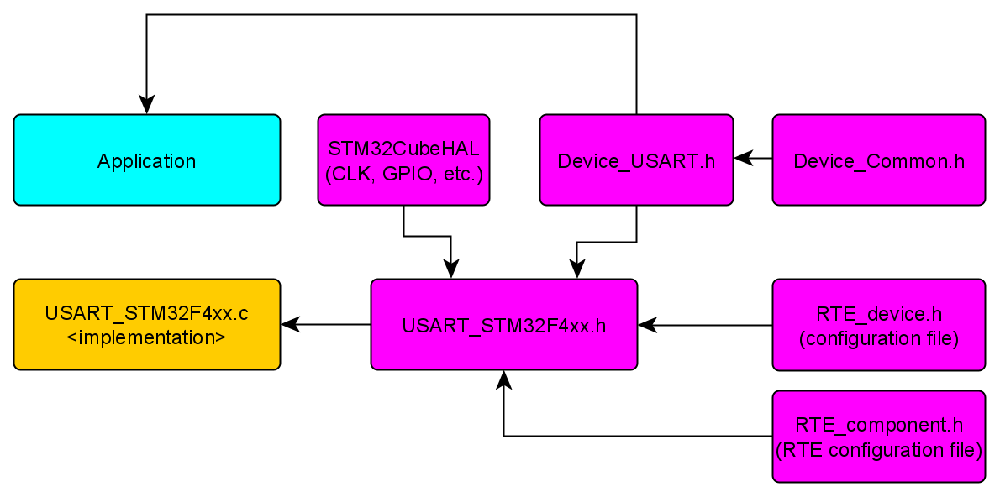

# CMSIS

<q>The CMSIS is a set of tools, APIs, frameworks, and work flows that help to simplify software re-use, reduce the learning curve for microcontroller developers, speed-up project build and debug, and thus reduce the time to market for new applications.</q>

CMSIS is open-source and collaboratively developed on GitHub.

 </img>

## Why CMSIS ?

- CMSIS reduces the learning curve, development costs, and time-to-market. Developers can write software quicker through a variety of easy-to-use, standardized software interfaces.
- Consistent software interfaces improve the software portability and re-usability. Generic software libraries and interfaces provide consistent software framework.
- It provides interfaces for debug connectivity, debug peripheral views, software delivery, and device support to reduce time-to-market for <strong>new microcontroller</strong> deployment.
- It allows to use the compiler of your choice, as it is compiler independent and thus supported by mainstream compilers.
- It enhances program debugging with peripheral information for debuggers and ITM channels for printf-style output.
- CMSIS is delivered in CMSIS-Pack format which enables fast software delivery, simplifies updates, and enables consistent integration into development tools.
- CMSIS-Zone will simplify system resource and partitioning as it manages the configuration of multiple processors, memory areas, and peripherals.
- Continuous integration is common practice for most software developers nowadays. CMSIS-Build supports these workflows and makes continuous testing and validation easier.

## CMSIS naming convention

- <strong>CAPITAL</strong> names to identify Core Registers, Peripheral Registers, and CPU Instructions.
- <strong>CamelCase</strong> names to identify function names and interrupt functions.
- <strong>Namespace_</strong> prefixes avoid clashes with user identifiers and provide functional groups (i.e. for peripherals, RTOS, or DSP Library).

## CMSIS Core

CMSIS-Core (Cortex-M) implements the basic run-time system for a Cortex-M device and gives the user access to the processor core and the device peripherals. In detail it defines:

- Hardware Abstraction Layer (HAL) for Cortex-M processor registers with standardized definitions for the SysTick, NVIC, System Control Block registers, MPU registers, FPU registers, and core access functions.
- System exception names to interface to system exceptions without having compatibility issues.
- Methods to organize header files that makes it easy to learn new Cortex-M microcontroller products and improve software portability. This includes naming conventions for device-specific interrupts.
- Methods for system initialization to be used by each MCU vendor. For example, the standardized SystemInit() function is essential for configuring the clock system of the device.
- Intrinsic functions used to generate CPU instructions that are not supported by standard C functions.
- A variable to determine the system clock frequency which simplifies the setup the SysTick timer.

### Files structure 


### Example 1: STM32CubeHAL for STM32F407VG 


## CMSIS drivers

<q> The CMSIS-Driver specification is a software API that describes peripheral driver interfaces for middleware stacks and user applications.</q>

### Access struct
<q>The Access Struct is the interface of a driver to the middleware component or the user application.</q>

<q>A CMSIS-Driver publishes an Access Struct with the data type name ARM_DRIVER_xxxx that gives to access the driver functions.</q> e.g. <code>ARM_DRIVER_SPI</code>


### Peripheral Driver Interfaces and Middleware
- <strong>CAN:</strong> Interface to CAN bus peripheral.
- <strong>Ethernet:</strong> Interface to Ethernet MAC and PHY peripheral.
- <strong>I2C:</strong> Multi-master Serial Single-Ended Bus interface driver.
- <strong>MCI:</strong> Memory Card Interface for SD/MMC memory.
- <strong>NAND:</strong> NAND Flash Memory interface driver.
- <strong>Flash:</strong> Flash Memory interface driver.
- <strong>SAI:</strong> Serial audio interface driver (I2s, PCM, AC'97, TDM, MSB/LSB Justified).
- <strong>SPI:</strong> Serial Peripheral Interface Bus driver.
- <strong>Storage:</strong> Storage device interface driver.
- <strong>USART:</strong> Universal Synchronous and Asynchronous Receiver/Transmitter interface driver.
- <strong>USB:</strong> Interface driver for USB Host and USB Device communication.
- <strong>VIO:</strong> API for virtual I/Os (VIO).
- <strong>WiFi:</strong> Interface driver for wireless communication. 

### Data Transfer Functions
A CMSIS-Driver implements non-blocking functions to transfer data to a peripheral. This means that the driver configures the read or write access to the peripheral and instantly returns to the calling application. The function names for data transfer end with:

- <strong>Send</strong> to write data to a peripheral.
- <strong>Receive</strong> to read data from a peripheral.
- <strong>Transfer</strong> to indicate combined read/write operations to a peripheral.
During a data transfer, the application can query the number of transferred data items using functions named GetxxxCount. On completion of a data transfer, the driver calls a callback function with a specific event code.

During the data exchange with the peripheral, the application can decide to:

- Wait (using an RTOS scheduler) for the callback completion event. The RTOS is controlled by the application code which makes the driver itself RTOS independent.
- Use polling functions that return the number of transferred data items to show progress information or partly read or fill data transfer buffers.
- Prepare another data transfer buffer for the next data transfer.
- The following diagram shows the basic communication flow when using the _Send function in an application.



### Files

- <code>Device_<i>interface</i> </code> e.g. <code>Device_USART</code> This file contains the device struct declartion and this's the file included by the the middlewares and user application.
- <code>Device_Common.h</code> This file includes the common code between the communication peripherals interfaces e.g. general return code.
- <code>RTE_Device.h</code> This file is used to configure the peripherals interface enable state and the attached GPIO pins. 
- The rest are implementation dependent.

### Example 1: Keil IDE for STM32F407VG USART1 peripheral




### Example 2: application code for SPI
```C
#include "Driver_USART.h"
#include "stm32f4xx_hal.h"

extern ARM_DRIVER_USART Driver_USART1;

extern uint8_t g_rcvData;
uint8_t g_rcvData;

static void myUSART_callback(uint32_t event);
static void myUSART_callback(uint32_t event)
{
	ARM_DRIVER_USART* usart1 = &Driver_USART1;
	
	if((event & ARM_USART_EVENT_RECEIVE_COMPLETE) == ARM_USART_EVENT_RECEIVE_COMPLETE) {
		usart1->Send(&g_rcvData, 1);
		usart1->Receive(&g_rcvData, 1);
	}
}

int main () {
  HAL_Init();
	
	ARM_DRIVER_USART* usart1 = &Driver_USART1;
	
	usart1->Initialize(myUSART_callback);
	usart1->PowerControl(ARM_POWER_FULL);
	usart1->Control(ARM_USART_MODE_ASYNCHRONOUS |
                      ARM_USART_DATA_BITS_8 |
                      ARM_USART_PARITY_NONE |
                      ARM_USART_STOP_BITS_1 |
                      ARM_USART_FLOW_CONTROL_NONE, 9600);
	usart1->Control (ARM_USART_CONTROL_RX, 1);
	usart1->Control (ARM_USART_CONTROL_TX, 1);
	
	usart1->Receive(&g_rcvData, 1);
	
	while(1) {
		
	}
}

```

### reference 
<a href="https://www.keil.com/pack/doc/CMSIS/Driver/html/theoryOperation.html">https://www.keil.com/pack/doc/CMSIS/Driver/html/theoryOperation.html</a>

## CMSIS DSP

<q>The CMSIS DSP is software library, a suite of common signal processing functions for use on Cortex-M and Cortex-A processor based devices.</q>

It's fully implemented by ARM and uploaded on GitHub.

The library is divided into a number of functions each covering a specific category:

- Basic math functions
- Fast math functions
- Complex math functions
- Filtering functions
- Matrix functions
- Transform functions
- Motor control functions
- Statistical functions
- Support functions
- Interpolation functions
- Support Vector Machine functions (SVM)
- Bayes classifier functions
- Distance functions
- Quaternion functions

The library has generally separate functions for operating on 8-bit integers, 16-bit integers, 32-bit integer and 32-bit floating-point values.

When using a vectorized version, provide a little bit of padding after the end of a buffer (3 words) because the vectorized code may read a little bit after the end of a buffer. You don't have to modify your buffers but just ensure that the end of buffer + padding is not outside of a memory region.

### Using the Library
- Using uVision IDE, choose CMSIS DSP as a software component.
- Include the right DSP header file for your CMSIS API by searching for its location; right click on it and press "Go to the definition".


### Example 1: mean function with Keil

```C
#include "dsp/statistics_functions_f16.h"

int main () {
	float16_t vec[] = {1, 2, 3};
	float16_t result;
	arm_mean_f16(vec, sizeof(vec)/sizeof(*vec), &result);
	
	while(1);
}

```

### Example 2: mean function with GCC

#### To generate the library (.a files):

- Clone the CMSIS repository.
- Install CMake if you don't have it.
- Head to <code>CMSIS_5/CMSIS/DSP/source</code>
- Run cmake like this
	```
	cmake -DCMAKE_PREFIX_PATH="C:\Program Files (x86)\GNU Arm Embedded Toolchain\10 2020-q4-major" \
	-DCMAKE_TOOLCHAIN_FILE="D:\Workspaces\GitHub\cmsis_dsp\CMSIS_5\CMSIS\DSP\gcc.cmake" \
	-DARM_CPU="cortex-m4" \
	-DROOT="D:\Workspaces\GitHub\cmsis_dsp\CMSIS_5" \
	-G "Unix Makefiles"
	```
	- <code>CMAKE_PREFIX_PATH</code> should contain a path to GCC toolchain
	- <code>ARM_CPU</code> determine the CPU
	- <code>ROOT</code> The path to CMSIS repository
	- <code>G</code> The output of cmake (it's makefiles in this case).
- run <code>make</code> (you should have make)

### Add the library to the project 
- Make a folder with the name <code>lib</code> and add the libraries (e.g. libCMSISDSPStatistics) in it.
- Add the library name (without lib prefix and .a suffix) and the path to the linker flags:
	```
	-Llibs -lCMSISDSPStatistics
	```
- Add FPU flags
	```
	FPU_FLAGS     := -mfloat-abi=hard -fsingle-precision-constant -mfpu=fpv4-sp-d16
	```
- Include the library and use it
	```
	#include "DSP/Include/dsp/statistics_functions.h"
	```